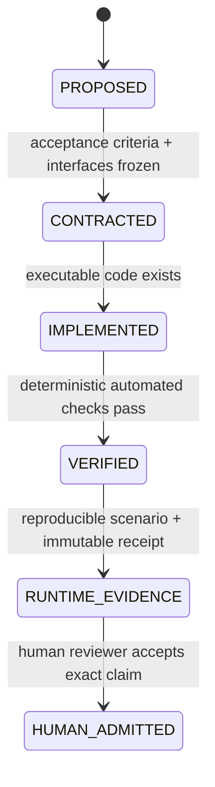
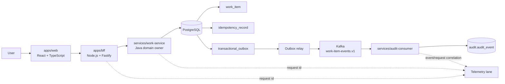
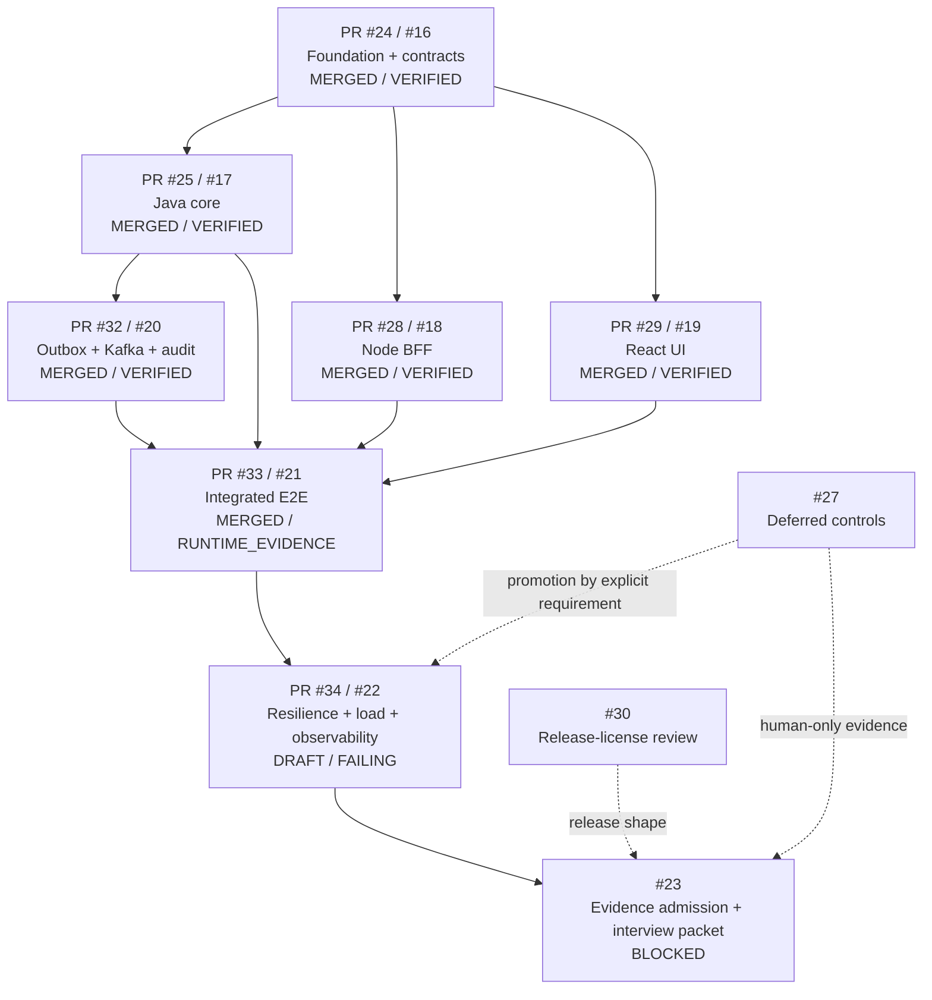

# Full Stack Notes

Evidence-first control plane and implementation portfolio for a **Full Stack Seed Engineer** role: end-to-end product delivery, Java and Node.js backend engineering, React product engineering, asynchronous recovery, resilience drills, and governed AI-assisted development.

> **Current integrated main:** PR-0 through PR-5 are merged. The repository has `RUNTIME_EVIDENCE` for **one deterministic pinned full-stack happy path** through React -> BFF -> Java -> PostgreSQL -> transactional outbox -> Kafka -> audit consumer.
>
> **Current frontier:** PR #34 / issue #22 is `IMPLEMENTED / FALSIFICATION_IN_PROGRESS`. Its latest exact-head workflow failed before resilience admission. The repository therefore does **not** yet prove resilience/load/observability closure, production SLOs, real incident ownership, mentoring impact, organization-wide AI adoption, or `HUMAN_ADMITTED` experience.

## Product slice

The product scenario is an **Operations Work Queue**. A user creates and tracks work items; the system must prevent duplicate creation, preserve valid state transitions, emit durable events, tolerate eventual-consistency mechanics, reject stale UI state, and expose enough evidence to explain what happened.

## Evidence state machine

Evidence is **claim-scoped**. A directory or PR can be `VERIFIED` while a broader runtime capability remains open. Markdown, design intent, or a green unrelated check cannot advance an evidence state.

## Integrated architecture and dataflow

Ownership invariants:

- `apps/web` talks to the BFF only; it does not own Java domain invariants.
- `apps/bff` owns edge validation/shaping, request correlation, deadlines/retries, local rate limiting, and graceful shutdown; it does not connect to PostgreSQL.
- `services/work-service` owns work-item domain invariants, optimistic concurrency, idempotency, transactions, persistence, and the transactional outbox.
- `services/audit-consumer` owns at-least-once event consumption and the audit projection; it must tolerate duplicate delivery.
- `packages/contracts` defines API/event boundaries and contains no business logic.
- `infra/integration` assembles the pinned deterministic full-stack runtime; `infra/resilience` and resilience/load harnesses are the active falsification lane, not admitted evidence yet.

## Repository map, state, and responsibility

| Path | Responsibility | Current evidence ceiling | Canonical node |
|---|---|---|---|
| `packages/contracts/**` | OpenAPI + event schema boundary | `VERIFIED` | PR #24 / #16 |
| `services/work-service/**` | Java domain, SQL, idempotency, optimistic concurrency, outbox | `VERIFIED` | PR #25 + PR #32 / #17 + #20 |
| `apps/bff/**` | Node edge policy, typed upstream boundary, deadline/retry/rate-limit/shutdown | `VERIFIED` (single-process deterministic scope) | PR #28 / #18 |
| `apps/web/**` | React work queue, async-state race/conflict/error correctness | `VERIFIED` | PR #29 / #19 |
| `services/audit-consumer/**` | Kafka consumer, duplicate integrity, audit projection, DLT policy | `VERIFIED` | PR #32 / #20 |
| `infra/integration/**`, `tests/e2e/**` | pinned full-stack assembly + one happy-path runtime receipt | `RUNTIME_EVIDENCE` (one deterministic CI/local path) | PR #33 / #21 |
| `infra/resilience/**`, `tests/failure/**`, `tests/load/**`, observability config | fault injection, multi-instance/LB, saturation, lag, load, telemetry | `IMPLEMENTED / FALSIFICATION_IN_PROGRESS` | PR #34 / #22 |
| `docs/evidence/**`, interview/admission docs | package exact receipts and human admission decisions | `CONTRACTED`; final admission blocked by #22 | #23 |
| deferred controls in #27 | optional stricter Java/edge/frontend/release controls | `DEFERRED / NOT_IMPLEMENTED` | #27 |
| release/license follow-up | Vite/lightningcss distribution-shape obligations | `REVIEW_REQUIRED` | #30 |

## Canonical execution DAG

`#16` through `#21` are closed because their exact scoped acceptance/evidence gates were reached and their PRs are merged. `#22`, `#23`, `#27`, and `#30` remain open intentionally.

## git-town-stacked-pr-worker traceability index

The implementation was decomposed into molecular stack nodes. Parentage follows semantic dependencies; after parent admission, child PRs were retargeted to `main` only when their subject bytes remained valid and mergeability was re-evaluated.

| Node | Issue / PR | Branch | Verified subject head | Evidence ceiling | Main merge receipt |
|---|---|---|---|---|---|
| PR-0 | #16 / #24 | `agent/full-stack-readiness-mvp-foundation` | `f0a7e00cfdb6e80ca6f9b128f280110ccf4a3fc9` | `VERIFIED` foundation/contracts | `f91c2e48f98c8f13f854fe8e2444934cee44c862` |
| PR-1 | #17 / #25 | `agent/pr1-java-work-service` | `10d8ecb3366d9ccfd21bcde102dd13cd8fbdc159` | `VERIFIED` Java transactional core | `b3c30c416031b4ab820883ab2e3694572fec12f9` |
| PR-2 | #18 / #28 | `agent/pr2-node-bff` | `1ee2ba05bbd1c5bde5f2c7b6f7e39a41024faf29` | `VERIFIED` BFF boundary | `a4f71b95c7e40ed0b04c6396e4acffe460ae9959` |
| PR-3 | #19 / #29 | `agent/pr3-react-work-queue` | `a41f310050934dc182cb4e136a326da48557f24e` | `VERIFIED` React async correctness | `5acc847e705f55071fd969619af2c7acde92aff4` |
| PR-4 | #20 / #32 | `agent/pr4-outbox-kafka` | `fcb161363d7b87be5757fdee0fa00007277abacf` | `VERIFIED` async recovery core | `60c81cc9c7ead888378b09bd7cb6af57d8a8e544` |
| PR-5 | #21 / #33 | `agent/pr5-e2e-runtime` | `c8e644fbd85cf495bc11b7954c38ef075d828702` | `RUNTIME_EVIDENCE` for one deterministic integrated happy path | `301c60982f1d2c9c26900dc946b628627ba6362a` |
| PR-6 | #22 / #34 | `agent/pr6-resilience-observability` | `62f510759b1a9418c325cad8337a31b8c5f6bd18` | `IMPLEMENTED / FALSIFICATION_IN_PROGRESS` | **not merged** |

Detailed routing rules remain in [`docs/stacked-prs/README.md`](docs/stacked-prs/README.md).

## Real-problem closure matrix

| Problem / failure | What is actually closed | What remains open |
|---|---|---|
| Duplicate mutation retry / concurrent create | deterministic Java idempotency + replay correctness is `VERIFIED` | distributed/high-load retry pressure is not production evidence |
| Concurrent work-item transitions | optimistic versioned update / lost-update prevention is `VERIFIED` | DB saturation/deadlock diagnostics remain #22/#27 |
| Downstream timeout/retry | BFF bounded deadline/retry semantics are `VERIFIED` | measured full-runtime latency/saturation recovery remains #22 |
| Stale React response / false UI state | stale-response suppression, failed-create state and 409 reconciliation are `VERIFIED` | browser/Web-Vitals/long-run leak profiling is not admitted |
| DB commit vs Kafka publish | transactional outbox and durable retry semantics are `VERIFIED`; integrated happy path reached Kafka/audit | broker-outage recovery timing and convergence receipt remains #22 |
| Kafka duplicate delivery / poison handling | duplicate projection integrity and bounded/DLT component behavior are `VERIFIED` | consumer lag/restart convergence measurement remains #22 |
| Full vertical slice | one pinned deterministic React->BFF->Java->DB->outbox->Kafka->audit run is `RUNTIME_EVIDENCE` | resilience/load/production operation is not proven |
| DB pool exhaustion / multi-instance LB / telemetry failure | harness exists | latest PR #34 exact-head run fails during work-service startup before these drills can be admitted |
| Production ownership / mentoring / org adoption | **not closed** | human-supplied evidence only; #23/#27 |
| Release third-party obligations | direct functional work is not blocked | Vite/lightningcss distribution-shape/NOTICE/SBOM review remains #30 |

The failure catalog and job-gap matrix use the same claim-scoped states. External articles/PDFs are decision inputs only; none can close a capability without the executable chain defined in `docs/research/SOURCE_REGISTRY.md`.

## PR #34 falsification status

Latest exact subject:

- head: `62f510759b1a9418c325cad8337a31b8c5f6bd18`
- workflow run: `32389681008`
- job: `96492505763`
- artifact: `pr6-resilience-62f510759b1a9418c325cad8337a31b8c5f6bd18`
- artifact digest: `sha256:8ec6bb6968c62a3d77bae8723e037a6edf1f2c437b77bc61b7360b1689f48b67`

Primary falsification: `work-service-1` fails during Flyway startup because the resilience topology starts the application with a two-connection Hikari pool and the pool is already fully active; Flyway cannot obtain a connection and times out. This means the fault condition is contaminating bootstrap instead of measuring runtime pool exhaustion/recovery.

Secondary harness defect: `stop_named` constructs `pid_file` from `name` in the same `local` command under `set -u`; cleanup can therefore throw `name: unbound variable` and mask the primary failure. Both are execution-harness defects, not accepted resilience evidence.

See [`docs/handoff/LOCAL_HANDOFF_EXECUTION_QUEUE.md`](docs/handoff/LOCAL_HANDOFF_EXECUTION_QUEUE.md).

## Engineering governance

- **GitHub is canonical** for requirement IDs, ADRs, code, issues, branches, PRs, checks, evidence paths, and closure state.
- **Tech Lead** is the only writer/controller in this workflow.
- **Shadow Architect** is read-only and audits architecture drift, failure/evidence gaps, and unsupported claims.
- Google Sheets/Docs are projections and must be corrected from GitHub if they drift.
- Do not resurrect the superseded Delivery Pulse control plane; canonical execution is #16-#23 plus #27/#30 side controls.
- Do not mark #22 ready/merged until a fresh exact-head full drill succeeds and receipts are audited.
- Do not mark `HUMAN_ADMITTED` from repository simulation alone.

## License

Repository code is Apache-2.0. Third-party dependencies retain their own licenses. Release-shape-dependent MPL-2.0 review for Vite's transitive `lightningcss` remains tracked in #30; closure requires concrete distribution/NOTICE/SBOM evidence, not assumptions.