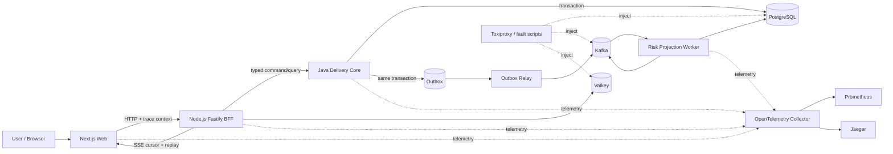

# Full Stack Notes

Evidence-first control plane and implementation portfolio for a **Full Stack Seed Engineer** role: end-to-end product delivery, Java and Node.js backend engineering, React product engineering, distributed-system resilience, and governed AI-assisted development.

> Candidate evidence state: `CONTROL_PLANE_DEFINED`.
>
> This branch defines requirements, contracts, architecture, work decomposition, and proof gates. It does **not** yet prove a deployed MVP, production traffic, operational ownership, organizational adoption, or real incident recovery.

## Role thesis

The target is not a conventional people-manager position. It is a technical-multiplier role that is expected to:

1. turn ambiguous product needs into bounded, testable product increments;
2. own the frontend, Node.js edge, Java domain backend, data model, release, and operations path;
3. review and correct AI-generated code instead of treating model output as authority;
4. expose cross-team bottlenecks and teach repeatable full-stack delivery practices;
5. produce production-shaped evidence: tests, performance budgets, failure receipts, runbooks, postmortems, and rollback decisions.

## Portfolio MVP — Delivery Pulse

**Delivery Pulse** is a cross-team product-delivery control tower. A user creates an initiative, defines acceptance constraints and handoffs, moves it through an auditable workflow, and observes live delivery risk, SLA pressure, failed transitions, and recovery actions.

The product is deliberately chosen to exercise the job's real boundaries rather than to become another CRUD demo:

- ambiguous idea → explicit specification and acceptance contract;
- React rendering, state ownership, accessibility, and frame budgets;
- Node.js BFF aggregation, session boundary, rate limiting, and SSE replay;
- Java concurrency, transaction boundaries, idempotency, locks, and backpressure;
- PostgreSQL modelling and zero-downtime migration discipline;
- Kafka asynchronous decoupling, ordering, retry, DLQ, and eventual consistency;
- service resilience, trace propagation, SLOs, failure injection, rollback, and postmortems;
- AI-assisted change packets with exact constraints, human review, tests, and rejected-candidate evidence.

## Recommended baseline

| Plane | Selection | Responsibility |
|---|---|---|
| Web product | React 19.2 + Next.js 16.2 Active LTS + strict TypeScript | rendering strategy, accessibility, interaction, performance attribution |
| Web edge/BFF | Node.js 24 LTS + Fastify | session/web contract, aggregation, SSE, request budgets; no core-domain authority |
| Core backend | Java 21 baseline, Java 25 CI lane + Spring Boot 4.1 | domain invariants, transactions, concurrency, outbox, APIs |
| Data | PostgreSQL 18 + Flyway Core | source-of-truth model, migrations, locking and query evidence |
| Async | Apache Kafka | durable events, partition ordering, retry and consumer lag evidence |
| Cache/control | Valkey | bounded cache, tenant-aware rate limiting and deduplication hints; never source of truth |
| Resilience | Resilience4j + Toxiproxy | timeout, retry, bulkhead, circuit breaker and injected network faults |
| Verification | JUnit, Testcontainers, Vitest, Playwright | unit, contract, integration and browser acceptance evidence |
| Observability | OpenTelemetry Collector + Prometheus + Jaeger | traces, metrics, logs and cross-service correlation |
| Delivery | Docker Compose first; Kubernetes/cloud only after the vertical slice | reproducible local proof before operational expansion |

The architecture starts as a **modular monolith plus explicit web edge and asynchronous worker**, not a résumé-driven microservice fleet. A service may be extracted only after an ADR names the ownership, scaling, availability, or release reason and supplies migration/rollback proof.

## End-to-end data flow



Detailed ownership, consistency laws, request/event flows, capacity assumptions, and failure paths are in [`docs/architecture/README.md`](docs/architecture/README.md).

## Target implementation tree

```text
Full-Stack-Notes/
├── AGENTS.md
├── README.md
├── prd/
│   └── requirements.json
├── apps/
│   ├── web/                         # Next.js / React product surface
│   └── bff/                         # Node.js / Fastify web edge
├── services/
│   └── delivery-core/               # Java modular-monolith domain owner
├── workers/
│   └── risk-projection/             # Kafka consumer/projection owner
├── packages/
│   └── contracts/                   # generated clients and shared schemas only
├── contracts/
│   ├── openapi/
│   └── events/
├── infra/
│   ├── compose/
│   ├── observability/
│   └── k8s/                         # Phase 2; absent until justified
├── tests/
│   ├── contract/
│   ├── e2e/
│   ├── load/
│   └── chaos/
├── evidence/
│   ├── deterministic/
│   ├── runtime/
│   ├── performance/
│   ├── incidents/
│   └── ai-assisted/
├── docs/
│   ├── architecture/
│   ├── role/
│   ├── product/
│   ├── operations/
│   ├── governance/
│   ├── ai/
│   └── interview/
├── manifests/
│   ├── sources.yaml
│   └── stack.yaml
└── .github/
```

Directories appear only when their first owned contract or implementation exists; empty directories are not evidence.

## Requirement and evidence State Machine

```text
SOURCE_PROPOSAL
→ REQ_ID_BOUND
→ OWNER_AND_CONTROL_BOUND
→ ARCHITECTURE_ADMITTED
→ API_EVENT_CONTRACT_FROZEN
→ VERTICAL_SLICE_IMPLEMENTED
→ DETERMINISTIC_GATES_PASS
→ INTEGRATION_GATES_PASS
→ FAILURE_CONTROLS_PASS
→ PERFORMANCE_BUDGET_PASS
→ DEPLOYED_RUNTIME_RECEIPT
→ INCIDENT_AND_ROLLBACK_EXERCISED
→ HUMAN_ADMITTED
→ PORTFOLIO_CLAIM_ELIGIBLE
```

No state may be inferred from a later-looking artifact. In particular:

```text
README or ADR exists          != implementation exists
unit tests pass               != integration path works
Docker Compose starts         != production deployment
load generator ran            != SLO passed
fault script exists           != recovery was exercised
AI produced a patch           != patch was correct
closed GitHub issue           != capability is live-closed
public portfolio page exists  != professional production experience
```

## Repository routing

| Repository | Authority in this system |
|---|---|
| `ed3c/Full-Stack-Notes` | role requirement IDs, MVP source, implementation, issue/PR DAG, exact evidence and interview map |
| `ed3c/skills-shared` | pinned reusable Tech Lead, Shadow Architect, proof-loop and stacked-delivery methods; no consumer state |
| `ed3c/runtime-env` | pinned secret-free runtime requirements and fixed workload contracts; no credential values |
| `ed3c/agent-architect-notes` | learning plan and reusable interview knowledge; not Delivery Pulse execution truth |
| `ed3c/website-design-compiler` | optional design/performance reference evidence; no runtime dependency |
| `ed3c/skill-resume-site` | public presentation projection; links back to admitted evidence only |

Public repositories may expose sanitized capability evidence. Private repositories may be referenced by a stable opaque evidence ID and disclosure classification, but private URLs, customer data, credentials, vendor inventory, and unverifiable claims must not be projected publicly.

## GitHub, Google Sheets, and Google Docs

- **GitHub is canonical:** requirements, sources, decisions, code, tests, issues, PRs, receipts, postmortems, and claim eligibility.
- **Google Sheets is a dashboard projection:** requirement ID, current state, owner, issue, PR, CI, live receipt, postmortem, and interview readiness. A Sheet cell cannot promote evidence state.
- **Google Docs is presentation-only:** recruiter packet, interview pre-read, or printable case study generated from admitted GitHub evidence. It must not contain unique architecture or status truth.

See [`docs/governance/EVIDENCE_ROUTING.md`](docs/governance/EVIDENCE_ROUTING.md).

## Execution and molecular Stack index

- Bootstrap control-plane candidate: [draft PR #1](https://github.com/ed3c/Full-Stack-Notes/pull/1)
- Global convergence and Human Admit: [issue #2](https://github.com/ed3c/Full-Stack-Notes/issues/2)
- Contract, traceability and hollow-evidence gate: [issue #3](https://github.com/ed3c/Full-Stack-Notes/issues/3)
- Runnable React–Node–Java–PostgreSQL scaffold: [issue #4](https://github.com/ed3c/Full-Stack-Notes/issues/4)
- Java domain, transaction and concurrency: [issue #5](https://github.com/ed3c/Full-Stack-Notes/issues/5)
- React product, accessibility and rendering evidence: [issue #6](https://github.com/ed3c/Full-Stack-Notes/issues/6)
- Node BFF, deadlines, rate limits and SSE cleanup: [issue #7](https://github.com/ed3c/Full-Stack-Notes/issues/7)
- Outbox, Kafka, projection and SSE replay: [issue #8](https://github.com/ed3c/Full-Stack-Notes/issues/8)
- Observability, load and performance/SLO calibration: [issue #9](https://github.com/ed3c/Full-Stack-Notes/issues/9)
- Failure, recovery, migration and rollback game-day: [issue #10](https://github.com/ed3c/Full-Stack-Notes/issues/10)
- Governed AI-assisted candidate/reviewer/falsifier evidence: [issue #11](https://github.com/ed3c/Full-Stack-Notes/issues/11)
- Immutable production-like deployment and multi-instance operations: [issue #12](https://github.com/ed3c/Full-Stack-Notes/issues/12)
- Zero-context seed exercise and external projections: [issue #13](https://github.com/ed3c/Full-Stack-Notes/issues/13)
- Truthful professional production-story inventory: [issue #14](https://github.com/ed3c/Full-Stack-Notes/issues/14)
- Article, PDF, repository and stack-source intake: [issue #15](https://github.com/ed3c/Full-Stack-Notes/issues/15)

The complete capability DAG, path leases, relation vocabulary and proposed molecular branch topology are in [`docs/architecture/STACK_DAG.md`](docs/architecture/STACK_DAG.md). [`prd/requirements.json`](prd/requirements.json) binds every `FS-*` requirement to a primary and supporting issue.

```text
#3 contract gate
→ #4 runnable scaffold
→ #5 Java / #6 React / #7 Node siblings
→ #8 asynchronous closure
→ #9 measurable evidence
→ #10 game-day and #12 runtime proof
→ #13 seed/projection
→ #2 convergence and Human Admit

parallel independent lanes:
#11 AI evidence
#14 authentic human experience
#15 source intake
```

Issue order is not Git ancestry. Use a true child PR only when it consumes named unmerged parent bytes; otherwise branch from the same admitted base as a sibling or wait for the predecessor to merge.

## Agent and reviewer route

1. [`AGENTS.md`](AGENTS.md)
2. [`prd/requirements.json`](prd/requirements.json)
3. [`docs/architecture/README.md`](docs/architecture/README.md)
4. [`docs/architecture/STACK_DAG.md`](docs/architecture/STACK_DAG.md)
5. [`docs/role/ROLE_EVIDENCE_MATRIX.md`](docs/role/ROLE_EVIDENCE_MATRIX.md)
6. [`docs/governance/SHADOW_ARCHITECT_LEDGER.md`](docs/governance/SHADOW_ARCHITECT_LEDGER.md)
7. exact issue, PR base/head, checks, receipts, and closest directory instructions

## Current truthful status

```text
repository baseline                    PASS
Apache-2.0 repository license          PASS
role/control-plane candidate           DEFINED_ON_DRAFT_BRANCH
requirements and issue ownership       BOUND
contracts                              CANDIDATE_UNVALIDATED
MVP application code                   NOT_IMPLEMENTED
CI and deterministic proof             NOT_EXERCISED
live deployment                         NOT_EXERCISED
load/performance proof                  NOT_EXERCISED
failure and rollback exercises          NOT_EXERCISED
professional production claim           NOT_ESTABLISHED_BY_THIS_REPOSITORY
organizational full-stack adoption      NOT_EXERCISED
```
