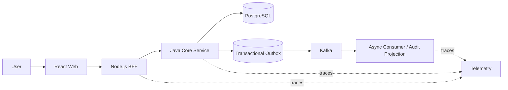
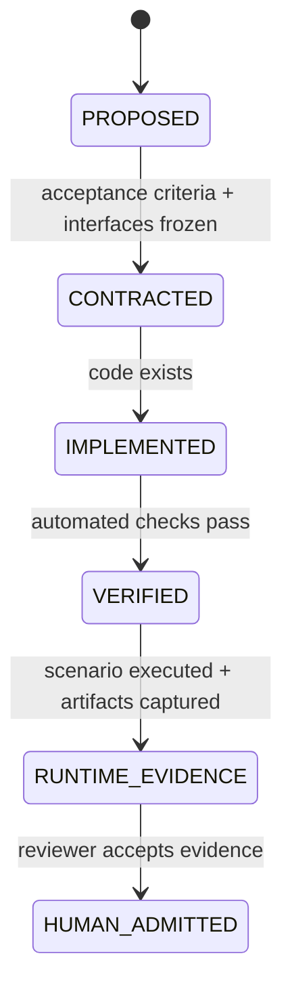
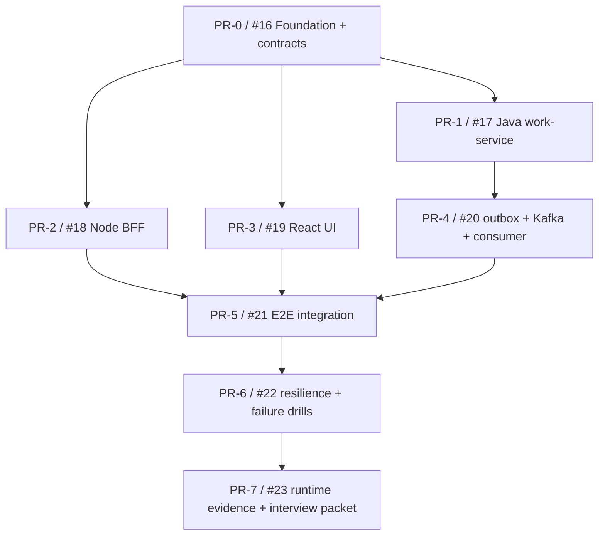

# Full Stack Notes

Evidence-first control plane and implementation portfolio for a **Full Stack Seed Engineer** role: end-to-end product delivery, Java and Node.js backend engineering, React product engineering, distributed-system resilience, and governed AI-assisted development.

> Current evidence state: `FOUNDATION_VERIFIED` on draft PR [#24](https://github.com/ed3c/Full-Stack-Notes/pull/24).
>
> Foundation contracts/governance are CI-verified; the product implementation is still not built. This repository does **not** yet prove a deployed MVP, production traffic, incident ownership, mentoring impact, or organization-wide AI adoption. Those states require implementation, runtime, incident, and human-review evidence.

## Target capability

The portfolio is designed to prove one production-shaped vertical slice instead of many disconnected tutorials:

- React product UI with TypeScript, component boundaries, state/error handling, testing, and performance budgets.
- Node.js BFF for edge validation, request correlation, rate limiting, aggregation, timeout/retry policy, and API shaping.
- Java service for domain invariants, persistence, concurrency control, idempotency, transactions, and asynchronous events.
- PostgreSQL as the source of transactional state.
- Kafka for asynchronous decoupling and eventual-consistency drills.
- OpenTelemetry-compatible traces/metrics/log correlation for evidence and debugging.
- CI, contract tests, failure injection, load tests, and evidence capture as first-class deliverables.

## Reference architecture



The first product scenario is an **Operations Work Queue**. A user creates and tracks work items; the backend must prevent duplicate creation, preserve state transitions, emit durable events, tolerate dependency failures, and expose enough telemetry to explain what happened.

## Truth state machine



Only `HUMAN_ADMITTED` evidence can be presented as proven experience from this repository. Real prior production experience must remain explicitly separated from portfolio simulations.

## Engineering governance

- **GitHub is canonical** for requirement IDs, ADRs, code, issues, branches, PRs, checks, evidence paths, and closure state.
- **Google Sheets is a projection** for capability/evidence dashboards and status views.
- **Google Docs is a projection** for review-friendly architecture narratives and interview packets.
- **Tech Lead** decomposes work, freezes contracts, owns acceptance gates, and routes implementation.
- **Shadow Architect** is read-only: it audits boundary drift, missing failure modes, unclosed evidence loops, and unsupported claims; it does not become a second writer.

## Repository map

```text
.
├── AGENTS.md
├── apps/
│   ├── web/                    # React + TypeScript product UI
│   └── bff/                    # Node.js edge/BFF
├── services/
│   ├── work-service/           # Java domain + persistence + outbox
│   └── audit-consumer/         # event-driven projection/consumer
├── packages/
│   └── contracts/              # OpenAPI/event contracts and generated boundaries
├── infra/                      # local runtime and observability
├── tests/
│   ├── contract/
│   ├── e2e/
│   ├── failure/
│   └── load/
├── docs/
│   ├── architecture/           # system, dataflow, state machines, ADRs
│   ├── evidence/               # evidence schema, audits, runs, projections
│   ├── research/               # source registry / article-PDF-repo routing
│   ├── role/                   # job-gap and interview evidence mapping
│   ├── stack/                  # technology and license decisions
│   └── stacked-prs/            # PR DAG / integration order
└── .github/workflows/          # CI and evidence gates
```

## Delivery DAG



Parallel PR-1/2/3 work begins from the frozen PR-0 contract boundary; implementation capability states do not advance merely because PR-0 is verified.

## License

Apache-2.0. Third-party dependencies keep their own licenses and must be recorded before release.
