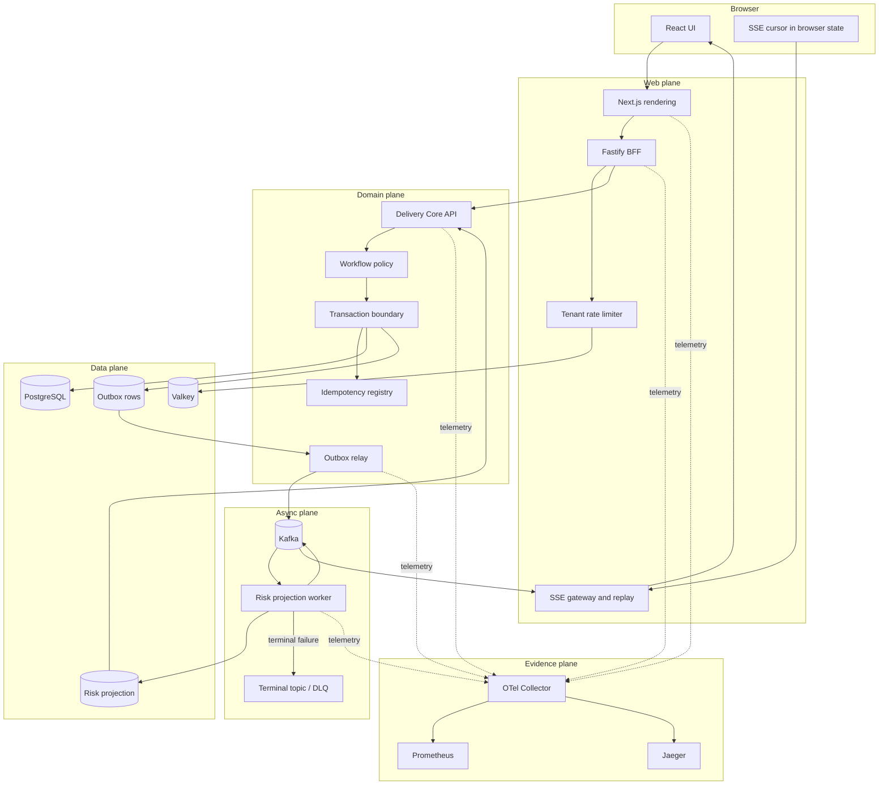

# Delivery Pulse Architecture

## 1. System objective

Delivery Pulse turns a cross-team delivery initiative into an auditable workflow with explicit acceptance constraints, handoff ownership, SLA clocks, risk projections, and recovery evidence.

The architecture must prove these role capabilities in one coherent vertical slice:

```text
product ambiguity
→ executable specification
→ React experience
→ Node.js web boundary
→ Java domain and concurrency
→ PostgreSQL model and migrations
→ Kafka asynchronous consistency
→ resilience and observability
→ deployment, failure, recovery and postmortem
```

## 2. Scope and non-goals

### MVP scope

- create, view, list, and transition an initiative;
- reject invalid or stale transitions deterministically;
- assign handoff owner and due time;
- emit durable initiative events through a transactional outbox;
- project delivery risk asynchronously;
- stream updates to the browser with resumable SSE cursors;
- expose trace-linked audit history and operational health;
- inject dependency faults and record recovery receipts.

### Non-goals for the first vertical slice

- arbitrary workflow builders;
- multi-region active-active writes;
- exactly-once end-to-end delivery claims;
- autonomous AI mutation of production state;
- Kubernetes, service mesh, GraphQL federation, event sourcing, CQRS fleet, or many independently deployed services without measured need;
- claims of real organizational adoption or professional production traffic.

## 3. Logical components and authority

| Component | Runtime | Owns | Must not own |
|---|---|---|---|
| `apps/web` | Next.js / React | UI composition, browser interaction state, accessibility, rendering and performance evidence | domain invariants, direct database access |
| `apps/bff` | Node.js / Fastify | session boundary, web-shaped aggregation, request budget, tenant rate limit, SSE cursor/replay | domain transaction, outbox, canonical workflow state |
| `services/delivery-core` | Java / Spring Boot | initiative aggregate, workflow policy, optimistic concurrency, idempotency, PostgreSQL transaction and outbox | browser state, notification delivery side effects inside core transaction |
| `workers/risk-projection` | Java / Spring Kafka | idempotent event consumption, risk/read projection, consumer lag and DLQ policy | command-side workflow decisions |
| PostgreSQL | database | canonical domain, idempotency, outbox, audit and projection tables | ephemeral cache policy |
| Kafka | event log | durable asynchronous transport inside declared partition/order policy | global exactly-once business truth |
| Valkey | key/value | bounded cache, session/rate-control assist, short-lived SSE coordination | canonical initiative or transition state |
| OTel/Prometheus/Jaeger | telemetry | traces, metrics, logs, alerts and evidence correlation | business state authority |

## 4. Context and container data flow



## 5. Primary write flow

```text
POST /v1/initiatives/{id}/transitions
  headers:
    Idempotency-Key
    If-Match / expectedVersion
    traceparent

BFF
  → authenticate/authorize
  → apply tenant request budget
  → validate web contract
  → forward typed command with absolute deadline

Delivery Core
  → validate command and actor
  → load initiative version
  → reject stale version or invalid transition
  → acquire only the necessary row/advisory lock when policy requires it
  → write new aggregate version
  → write idempotency result
  → append audit record
  → append outbox event
  → COMMIT once

Relay
  → claim unpublished outbox rows with bounded batch/lease
  → publish event keyed by initiativeId
  → mark publication metadata

Consumer
  → deduplicate eventId
  → update risk projection transactionally
  → emit derived risk event only after projection commit

BFF SSE
  → resume from event cursor
  → stream update or request a bounded replay
```

The API returns success only for the core transaction. It does not claim that every asynchronous projection or browser stream has already converged.

## 6. Data model

### Canonical tables

```text
initiative
  id UUID PK
  tenant_id UUID
  title TEXT
  description TEXT
  state VARCHAR
  handoff_owner_id UUID NULL
  due_at TIMESTAMPTZ NULL
  version BIGINT
  created_at TIMESTAMPTZ
  updated_at TIMESTAMPTZ

initiative_transition
  id UUID PK
  initiative_id UUID FK
  from_state VARCHAR
  to_state VARCHAR
  actor_id UUID
  reason TEXT
  aggregate_version BIGINT
  trace_id VARCHAR
  occurred_at TIMESTAMPTZ
  UNIQUE (initiative_id, aggregate_version)

idempotency_record
  tenant_id UUID
  idempotency_key VARCHAR
  request_hash VARCHAR
  response_code INT
  response_body JSONB
  expires_at TIMESTAMPTZ
  PRIMARY KEY (tenant_id, idempotency_key)

outbox_event
  event_id UUID PK
  aggregate_type VARCHAR
  aggregate_id UUID
  aggregate_version BIGINT
  event_type VARCHAR
  schema_version INT
  payload JSONB
  traceparent VARCHAR
  created_at TIMESTAMPTZ
  lease_owner VARCHAR NULL
  lease_until TIMESTAMPTZ NULL
  published_at TIMESTAMPTZ NULL
  publish_attempts INT
  UNIQUE (aggregate_id, aggregate_version, event_type)

consumer_inbox
  consumer_name VARCHAR
  event_id UUID
  processed_at TIMESTAMPTZ
  result_hash VARCHAR
  PRIMARY KEY (consumer_name, event_id)

initiative_risk_projection
  initiative_id UUID PK
  risk_level VARCHAR
  reasons JSONB
  source_version BIGINT
  calculated_at TIMESTAMPTZ
```

Every tenant-scoped query includes `tenant_id`; authorization tests must include cross-tenant negative controls. Database row-level security may be evaluated later, but application enforcement and query-scoped tests are mandatory from the first slice.

## 7. Consistency and concurrency laws

### Command consistency

- Initiative transition is strongly consistent inside one PostgreSQL transaction.
- `version` provides optimistic concurrency; `expectedVersion` rejects stale UI or duplicate parallel actions.
- Pessimistic/advisory locks are admitted only for a measured race that optimistic retry cannot safely handle.
- Idempotency key reuse with a different request hash returns a conflict, not the original response.

### Event consistency

- Outbox and aggregate update share one transaction.
- Delivery is at least once; producers and consumers must tolerate duplicates.
- Ordering is guaranteed only for events keyed by the same `initiativeId` in the same topic/partition policy.
- Consumer projection ignores an older aggregate version and records the decision.
- DLQ is terminal routing evidence, not recovery. A replay runbook must define validation, correction, replay, and residue checks.

### Cache consistency

- Valkey entries are disposable and bounded by TTL.
- Cache invalidation may lag; responses identify projection/source version where stale reads matter.
- A cache outage degrades latency/features but cannot corrupt domain state.

## 8. Threading, asynchronous work and backpressure

### Java

- Use virtual threads for request-per-task blocking I/O, with explicit deadlines and bounded downstream concurrency.
- Do not pool virtual threads. Bound scarce resources at the database connection pool, Kafka producer, external dependency, or explicit semaphore.
- Avoid long blocking operations while holding JVM monitors; include a pinning diagnostic test/profile.
- Structured cancellation is required: request deadline expiration cancels downstream work and records the terminal reason.
- Thread-local/MDC use must be tested for trace and tenant-context isolation.

### Node.js

- Keep CPU-heavy work out of the event loop; reject or offload bounded work rather than hiding it in a Promise chain.
- Every upstream call has an absolute deadline, abort signal, response-size limit, and concurrency budget.
- SSE connections have tenant/global caps, heartbeat, cursor TTL, disconnect cleanup, and replay limits.
- Measure event-loop delay and open handles; a successful HTTP response does not prove resource cleanup.

### Kafka consumer

- Bound records per poll, processing concurrency, retry attempts, and in-flight bytes.
- Commit offsets only after the consumer inbox and projection transaction succeeds.
- Expose lag, rebalance duration, handler latency, retry count, terminal count, and oldest unprocessed event age.

## 9. Resilience policy

| Concern | Required policy | Forbidden shortcut |
|---|---|---|
| timeout | absolute end-to-end deadline with smaller downstream budgets | independent defaults that exceed caller deadline |
| retry | bounded exponential backoff + jitter, retry only classified transient/idempotent operations | retrying validation errors, overload, or non-idempotent writes |
| circuit breaker | per dependency/operation, minimum sample and half-open budget | one global breaker hiding unrelated failures |
| bulkhead | bound DB, Kafka, SSE, and remote-call resources separately | treating virtual threads as infinite capacity |
| rate limit | tenant-aware token bucket plus global overload gate | one noisy tenant consuming all capacity |
| load shedding | reject early with typed response and retry guidance | queueing without bound |
| fallback | stale/read-only response only when version and staleness are visible | fabricated success or silently dropped write |

## 10. Frontend architecture and performance

### State ownership

- URL/query state: filters and shareable navigation.
- Server state: query cache with version-aware invalidation.
- Local interaction state: component-local unless multiple distant owners prove otherwise.
- Workflow draft: explicit form state with schema validation and unsaved-change behavior.
- SSE state: connection status, last cursor, replay status, stale indicator, and terminal error.

### Rendering strategy

- Server-render the shell and initial initiative list where it improves first content and shareability.
- Use client components only for interaction, live stream, and browser-only APIs.
- Stream slow independent sections; do not block the entire route on risk projection.
- Define loading, empty, partial, stale, offline, forbidden, and error states as product states, not afterthoughts.

### Budgets

Initial budgets are hypotheses and must be replaced by measured baselines:

```text
interaction frame work       p95 < 16 ms for target interactions
route JS                     budget per route, recorded by build artifact
avoidable re-render count    zero for unchanged initiative rows
LCP / INP / CLS              tracked in lab and field-like test; no claim before receipt
SSE reconnect                bounded backoff; no duplicate visible transition
```

React Profiler, browser performance traces, Web Vitals, bundle reports, and Playwright traces must point to the exact commit and scenario.

## 11. Observability and SLO candidates

### Trace contract

```text
browser interaction ID
→ W3C trace context at BFF
→ Java command span
→ PostgreSQL/outbox span
→ Kafka producer context
→ consumer/projection span
→ SSE delivery span
```

Logs are structured and include `trace_id`, `tenant_hash`, `initiative_id`, `event_id`, `aggregate_version`, `operation`, and `result`; they never include secrets or unrestricted user text.

### Candidate SLOs

These are design targets, not current claims:

```text
command API availability         99.9% monthly
command API latency              p95 < 300 ms, p99 < 800 ms at declared load
risk projection freshness        99% < 5 s under declared load
SSE visible update               p95 < 2 s after event publication
duplicate side effects           0 in tested duplicate/replay scenarios
cross-tenant data exposure       0 in deterministic/security controls
```

Every performance receipt must name hardware/runtime, dataset, warm-up, duration, concurrency, request mix, error denominator, percentile method, commit, and cleanup.

## 12. Security model

- OIDC/OAuth boundary may be stubbed locally, but authorization must be implemented and tested at the domain boundary.
- Use synthetic identities and least-privilege service credentials.
- Browser receives secure, HTTP-only session cookies; CSRF policy is explicit for state-changing browser requests.
- Validate request/event schemas and cap payload sizes.
- Encrypt transport in deployed environments and define secret rotation ownership.
- Generate SBOM, scan dependencies/containers/secrets, and enforce a license allowlist.
- AI-generated changes touching auth, authorization, SQL, serialization, concurrency, crypto, logging, or deployment require a named high-risk review lane.

## 13. Deployment evolution

```text
Phase 0  contracts and deterministic controls
Phase 1  Docker Compose vertical slice on one host
Phase 2  ephemeral PR environment + one public production-like environment
Phase 3  load/fault/rollback exercise with durable receipts
Phase 4  Kubernetes/cloud evaluation only when it proves a job requirement
```

A deployment receipt needs immutable image digests, migration result, health/readiness result, smoke scenario, trace link, rollback identity, and cleanup/residue state.

## 14. Alternatives and rejected defaults

| Decision | Selected | Rejected default | Reason |
|---|---|---|---|
| core language | Java | Java + Go from day one | the role requires one; dual stacks dilute proof and operational ownership |
| topology | modular monolith + BFF + worker | many microservices | preserves boundaries without distributed complexity for its own sake |
| browser updates | SSE | WebSocket first | server-to-client update is the initial requirement; simpler reconnect and infrastructure |
| domain/event consistency | transactional outbox/inbox | database + Kafka dual write | avoids an unclosed partial-commit window |
| workflow concurrency | optimistic version | global lock | makes conflict explicit and scales without serializing unrelated initiatives |
| migration | Flyway Core | current Liquibase Community | pinned Flyway core is Apache-2.0; current Liquibase licensing requires a separate legal/product decision |
| cache | Valkey | source-of-truth cache | permissive licensing and disposable-control role |
| orchestration | Compose first | Kubernetes first | proves the product and operations loop before platform expansion |

## 15. Architecture closure gates

Architecture may advance from `CANDIDATE` only when:

```text
all applicable FS requirements have owners and controls
AND OpenAPI/event contracts validate
AND no component has conflicting source-of-truth authority
AND failure catalogue covers every async and remote boundary
AND security and tenancy negative controls exist
AND live/performance lanes remain truthfully NOT_EXERCISED until run
AND critical Shadow findings are fixed or have open owning issues
```
