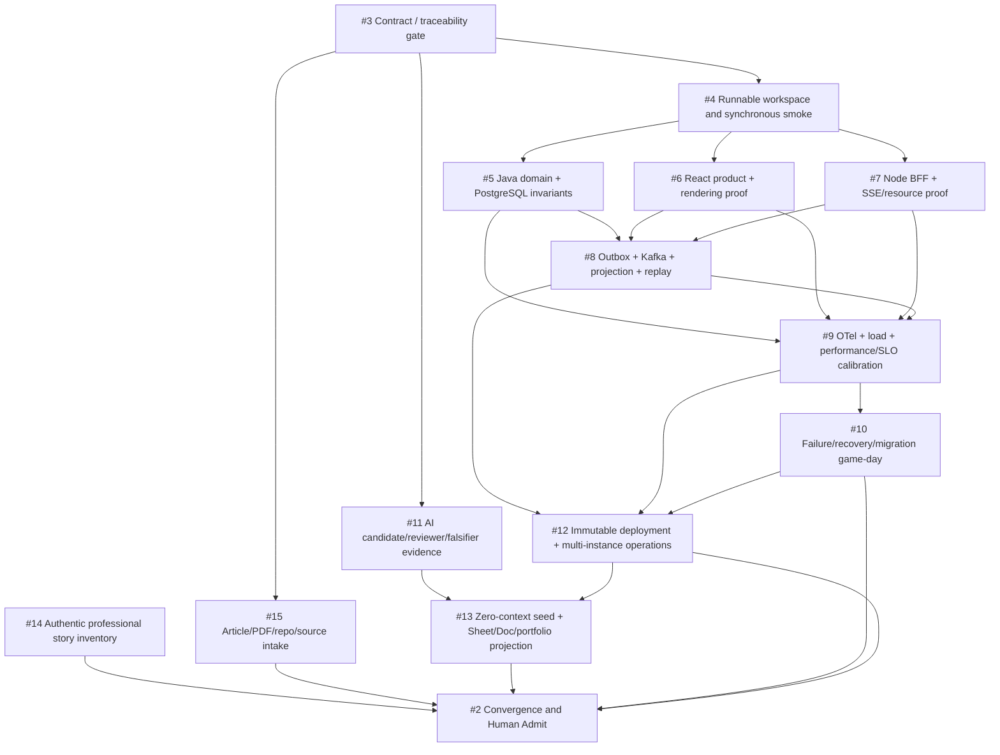

# Molecular Stack and Evidence DAG

Convergence owner: **#2**. Bootstrap candidate: **draft PR #1**.

## Capability DAG



This diagram expresses capability/process dependencies. It is **not automatically a Git branch ancestry graph**.

## Issue ownership and evidence ceiling

| Issue | Owner plane | Primary output | Maximum truthful closure |
|---:|---|---|---|
| #3 | controls | parsers, traceability, policy and mutation gates | `CONTRACT_CLOSED` |
| #4 | workspace/convergence | runnable React→Node→Java→PostgreSQL smoke | integration proof |
| #5 | Java/data | domain, transaction, concurrency, migration controls | deterministic/integration |
| #6 | web | product states, accessibility, rendering and browser evidence | browser/deterministic |
| #7 | Node edge | session, deadline, rate/SSE resources and ADR evidence | integration/browser |
| #8 | async | outbox, Kafka, inbox, projection and replay correctness | integration/browser |
| #9 | evidence | trace correlation and calibrated load/performance receipts | exact runtime lane only |
| #10 | operations | failure, recovery, rollback, reconciliation and postmortem | game-day environment only |
| #11 | AI governance | task packets, rejected candidates and falsifiers | AI/review lane only |
| #12 | runtime | immutable deployment and multi-instance operation | `PORTFOLIO_LIVE` for exact environment |
| #13 | enablement | zero-context exercise and external projections | exercise/projection only |
| #14 | human evidence | truthful professional story capsules | `PROFESSIONAL` only after Eeon admits facts |
| #15 | research | dated source/claim/applicability/license graph | research/traceability only |
| #2 | Tech Lead convergence | global readback and Human Admit decision | no higher than weakest applicable open lane |

## Molecular branch rule

Use these relations exactly:

```text
SIBLING
  same admitted base, path-disjoint implementation, no unmerged-byte dependency

TRUE_CHILD
  child consumes a named schema, generated client or implementation byte that exists only on the unmerged parent

CONVERGENCE
  one owner integrates already verified predecessors and shared indexes

PROCESS_DEPENDENCY
  work must happen earlier, but no Git ancestry is implied

EXTERNAL_EVIDENCE
  benchmark, Shadow, security, failure or runtime lane evaluates an immutable candidate independently

HUMAN_EVIDENCE
  fact can only be supplied/admitted by the person who experienced it
```

## Recommended Stack plan

The branch names below are proposals, not current branches.

```text
main
└─ agent/fs-control-gates                       # #3
   └─ agent/fs-runnable-scaffold                # #4, true child only while consuming unmerged gate/scaffold files
      ├─ agent/fs-java-domain                   # #5 sibling after scaffold merges
      ├─ agent/fs-react-product                 # #6 sibling after scaffold merges
      └─ agent/fs-node-bff                      # #7 sibling after scaffold merges

After #5/#6/#7 contracts are admitted:
└─ agent/fs-async-loop                          # #8

Independent evidence siblings from the applicable admitted base:
├─ agent/fs-observability-performance          # #9
├─ agent/fs-ai-review-evidence                  # #11
├─ agent/fs-source-intake                       # #15
└─ agent/fs-game-day                            # #10 after #9 baseline

Runtime and final projection:
└─ agent/fs-runtime-deployment                  # #12
   └─ agent/fs-seed-projection                  # #13 only if it consumes unmerged runtime receipts; otherwise sibling after merge

Final shared index/readback:
└─ agent/fs-epic-convergence                    # #2
```

Do not create a long chain merely to preserve issue order. Once a predecessor is merged, later work normally branches from the updated admitted base.

## Path leases

| Issue | Initial owned paths |
|---:|---|
| #3 | `scripts/`, `.github/workflows/`, `schemas/`, control fixtures |
| #4 | root build/workspace files, `infra/compose/`, initial service/app skeletons |
| #5 | `services/delivery-core/`, Java-owned migrations/tests |
| #6 | `apps/web/`, web/component/browser-owned tests and evidence |
| #7 | `apps/bff/`, Node-owned tests and operational evidence |
| #8 | `workers/risk-projection/`, async contracts/adapters/tests; cross-plane edits need explicit lease transfer |
| #9 | `infra/observability/`, `tests/load/`, `evidence/performance/`, telemetry receipts |
| #10 | `tests/chaos/`, `docs/operations/`, `evidence/incidents/` |
| #11 | `docs/ai/`, `evidence/ai-assisted/`, AI control fixtures |
| #12 | deployment/runtime manifests, `evidence/runtime/`, deployment runbooks |
| #13 | projection manifests/scripts, enablement receipts; writes to other repos require their own PRs |
| #14 | private-first story inventory; public sanitized capsules only after Human Admit |
| #15 | `manifests/sources.yaml`, source decisions/ADRs and audit receipts |
| #2 | root/shared README, AGENTS, indexes and aggregate closure ledger |

One active writer owns each path. A cross-path change either moves to the owning issue or records a time-bounded lease transfer.

## Data/evidence flow through the DAG

```text
job/source claim (#15)
→ stable FS requirement (#3)
→ frozen HTTP/event/evidence contract (#3)
→ runnable boundary (#4)
→ domain/web/BFF implementation (#5/#6/#7)
→ async consistency (#8)
→ exact telemetry and denominator (#9)
→ failure/recovery evidence (#10)
→ immutable deployment (#12)
→ AI/seed/process evidence (#11/#13)
→ authentic professional context where available (#14)
→ independent Shadow readback
→ #2 Human Admit
→ Google Sheet / Google Doc / skill-resume-site projection
```

## Global close rule

#2 may close only when every applicable predecessor is either:

```text
CLOSED_WITH_ADMISSIBLE_EVIDENCE
OR OPEN_WITH_EXPLICIT_NON_BLOCKING_RATIONALE_AND_OWNER
OR HUMAN_EVIDENCE_NOT_AVAILABLE_WITH_CLAIM_NARROWED
```

A closed issue, merged PR, green CI, live URL or polished case study alone cannot satisfy the global objective.
