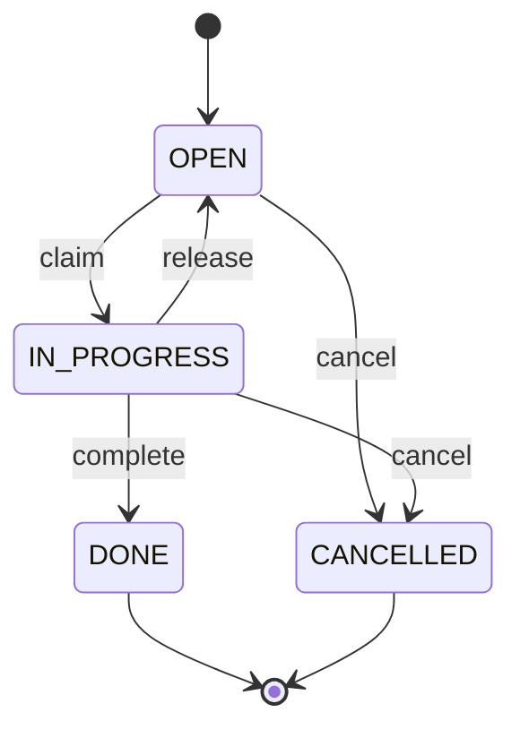
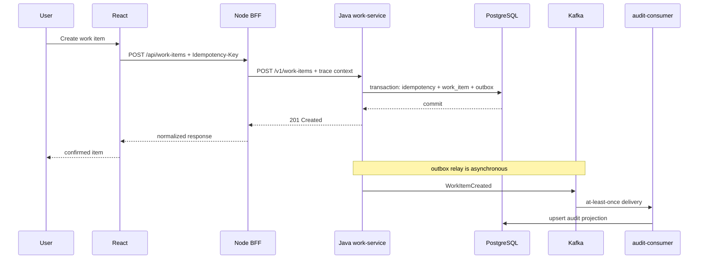

# System Design — Operations Work Queue

## Goal

Build one production-shaped end-to-end product that can demonstrate the role's required frontend, backend, distributed-systems, product, operations, and AI-assisted engineering behaviors.

The user creates and tracks work items used by an operations team. The product must remain explainable under duplicate requests, concurrent updates, slow dependencies, broker interruptions, consumer retries, and partial outages.

## Core invariants

- A client retry with the same idempotency key must not create a second work item.
- A work item transition must obey the domain state machine.
- A successful transactional write and its domain event must not diverge permanently.
- An event consumer must be safe under at-least-once delivery.
- A timeout must have a bounded budget; retries must not create unbounded retry storms.
- Every request must carry a correlation/trace identifier through BFF, Java service, and asynchronous processing.
- User-facing state must explicitly distinguish confirmed, pending, failed, and stale data.

## Domain state machine

Invalid transitions return a typed conflict response and emit no domain event.

## Request path

## Failure behavior

### Duplicate HTTP request

The Java service owns idempotency. A unique idempotency key is stored with a request fingerprint and result reference. Same key + same request returns the prior result; same key + different request is a conflict.

### Concurrent state transition

Use an optimistic version column. Competing updates cannot silently overwrite each other. The loser receives a conflict and must re-read current state.

### Database commit succeeds but broker is unavailable

Use a transactional outbox stored in the same database transaction as the domain write. A relay publishes pending outbox rows later. Broker availability is therefore not part of the synchronous create transaction.

### Duplicate Kafka delivery

Consumers store/derive a stable event identifier and perform idempotent projection writes. Redelivery is expected, not exceptional.

### Java service is slow/unavailable

BFF applies a total downstream timeout budget. Retry is allowed only for explicitly safe/idempotent operations, with bounded attempts and jitter. Non-idempotent mutation retries require an idempotency key.

### Failure amplification

Rate limiting and bounded concurrency protect expensive paths. A circuit breaker may be introduced only after measurable failure thresholds and fallback semantics are defined; it must not hide data loss.

## Consistency model

- Work-item command state: strongly consistent within PostgreSQL transaction boundaries.
- Audit/read projection: eventually consistent.
- UI: shows command confirmation independently from projection freshness.
- Cross-service workflows: no distributed transaction; recover through durable state and replayable events.

## Observability contract

Required per request/event:

- `trace_id`, `request_id`, and stable work-item/event IDs;
- latency by boundary;
- downstream timeout/retry count;
- HTTP status and typed error code;
- DB transaction outcome;
- outbox pending age/count;
- Kafka publish/consume lag where available;
- consumer retry/dead-letter count;
- state-transition conflict count;
- rate-limit rejection count.

Logs must not be the only evidence. Metrics/traces should allow a reviewer to answer: what failed, where, for how long, what user impact occurred, and whether recovery completed.

## Security baseline

- Validate untrusted input at edge and service boundaries.
- Do not trust BFF-only validation for domain invariants.
- No secrets in repository or frontend bundle.
- Use least-privilege DB/broker credentials in deployable environments.
- Propagate user identity/authorization context explicitly; do not infer authority from client-supplied resource fields.
- Add dependency and secret scanning before runtime-evidence admission.

## Performance budgets

Initial targets are hypotheses until measured:

- p95 create/list API latency target recorded per run.
- bounded BFF downstream timeout.
- frontend interaction/render budget captured with browser metrics.
- load-test throughput target must include error-rate and saturation evidence, not throughput alone.

Do not promote numeric targets to claims until a run artifact records hardware/runtime, dataset, concurrency, duration, and result distribution.

## Closure criteria

This architecture is not "done" when code compiles. Capability closure requires:

1. executable vertical slice;
2. automated unit/contract/E2E checks;
3. duplicate-request test;
4. concurrent-update test;
5. broker-outage/outbox recovery test;
6. duplicate-event consumer test;
7. timeout/retry or dependency-failure test;
8. trace/log/metric evidence for at least one failure run;
9. Shadow Architect closure audit;
10. human admission of the evidence claim.
