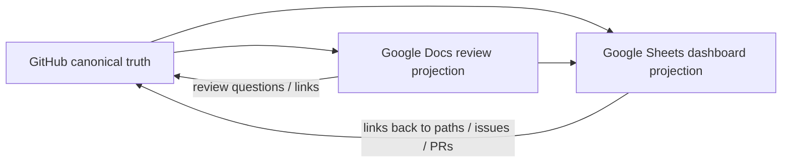

# External Projection Routing

GitHub remains the canonical engineering truth for this portfolio. Google Workspace artifacts exist to improve review, planning, and interview rehearsal; they never override repository state.

## Canonical control plane

- Repository: https://github.com/ed3c/Full-Stack-Notes
- Canonical requirement/evidence paths live under `docs/`, `packages/`, source directories, issues, pull requests, and CI artifacts.

## Google Workspace projections

### Evidence dashboard — Google Sheets

https://docs.google.com/spreadsheets/d/18A-7_WGku0kIkpeew4F4Dw6LAAVbqg-phaRQh8uSe-g

Purpose:

- capability truth-state dashboard;
- failure-drill tracking;
- canonical-link directory;
- review-friendly projection of issue/PR/evidence status.

Rules:

- values are projections from GitHub IDs/paths;
- status must never advance beyond the GitHub-backed evidence state;
- the dashboard timezone is `Asia/Taipei`;
- the sheet contains native tables and validated truth-state cells.

### Architecture & interview review packet — Google Docs

https://docs.google.com/document/d/1MRAXoPzDkjw1UTvkVuRK1ch7SBSFPfe4x2bAInpORvI

Purpose:

- architecture-review narrative;
- interview rehearsal questions;
- compact evidence-admission explanation;
- human-readable summary of Tech Lead / Shadow Architect boundaries.

The document contains a native Google Sheets rich-link to the evidence dashboard.

## Routing invariant

If the projections disagree with GitHub, GitHub wins. Fix the projection; do not mutate repository truth to match a stale dashboard or narrative.

## Source/article/PDF routing

External research artifacts must be registered in GitHub before they influence a capability claim. Each source record should include:

- stable source URL or repository path;
- source type (`ARTICLE`, `PDF`, `REPO`, `OFFICIAL_DOC`, `BENCHMARK`);
- exact claim or decision it informs;
- whether the source is descriptive, normative, or executable evidence;
- license/usage constraints when code or assets are imported;
- linked ADR/issue/PR/evidence run.

A source being cited does not prove the implemented system satisfies it. Closure still requires executable evidence and the repository truth-state gates.
