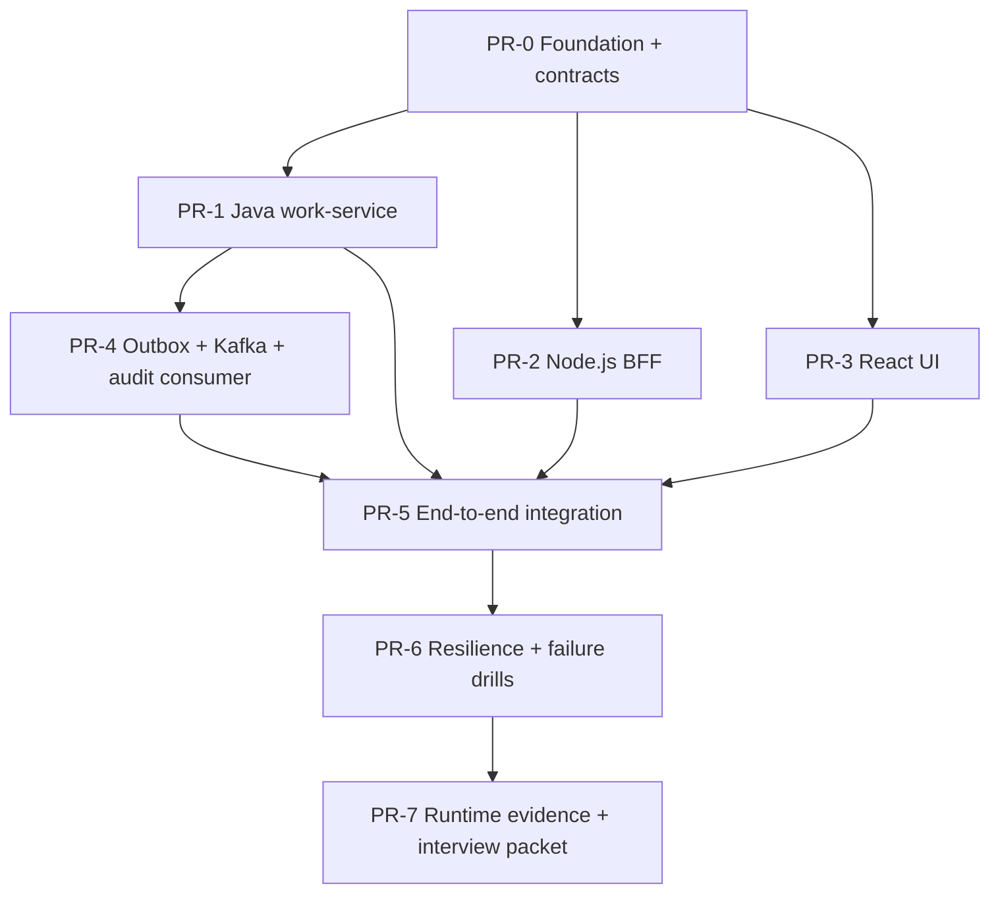

# Stacked PR Delivery Index

This directory is the implementation-routing index. The stack deliberately separates contracts from independently reviewable frontend/backend changes so parallel work does not invent incompatible boundaries.

## DAG

## Stack nodes

| Node | Primary paths | Dependencies | Exit gate |
|---|---|---|---|
| PR-0 | `README.md`, `AGENTS.md`, `docs/**`, `packages/contracts/**`, foundation CI | none | contracts parse + smoke checks; issues/DAG exist |
| PR-1 | `services/work-service/**` | PR-0 | Java domain/API persistence checks, duplicate create + concurrent transition tests |
| PR-2 | `apps/bff/**` | PR-0 | typed contract client, validation, timeout/rate-limit/graceful-shutdown tests |
| PR-3 | `apps/web/**` | PR-0 | create/list/transition UX with loading/error/stale-response tests |
| PR-4 | `services/work-service/**`, `services/audit-consumer/**`, event infra/contracts when version-compatible | PR-1 | transactional outbox + duplicate-consumer + broker-recovery tests |
| PR-5 | `infra/**`, `tests/contract/**`, `tests/e2e/**` | PR-1..4 | complete user journey executable against real DB/broker |
| PR-6 | `tests/failure/**`, `tests/load/**`, telemetry/runbooks | PR-5 | minimum failure set executed with correlated telemetry |
| PR-7 | `docs/evidence/runs/**`, interview/admission docs | PR-6 | Shadow Architect audit + human admission decision |

## Parallelism rules

- PR-1, PR-2, and PR-3 may proceed in parallel only after PR-0 contracts are frozen.
- A consumer may not change a contract in its own branch to make local code pass; contract changes return to a dedicated contract node/review.
- PR-4 depends on Java transaction semantics and therefore follows PR-1.
- PR-5 integrates rather than redesigns ownership boundaries.
- PR-6 must inject real failures; it cannot be replaced with prose about expected behavior.
- PR-7 may package existing evidence but cannot upgrade an evidence state without required artifacts.

## Branch naming

Use `agent/<node>-<short-purpose>` or the repository's Git Town-compatible naming policy. Stack parentage must match the DAG; do not point all child PRs directly at `main` when a child semantically depends on an unmerged parent.

## Merge safety

- Merge contracts before parallel implementations unless intentionally running a stacked branch chain.
- Rebase/update child branches after parent contract changes.
- Never auto-resolve semantic conflicts in API/event schemas, migrations, domain state machines, or evidence records.
- A green merge is not a closed capability issue until its required evidence state is satisfied.
