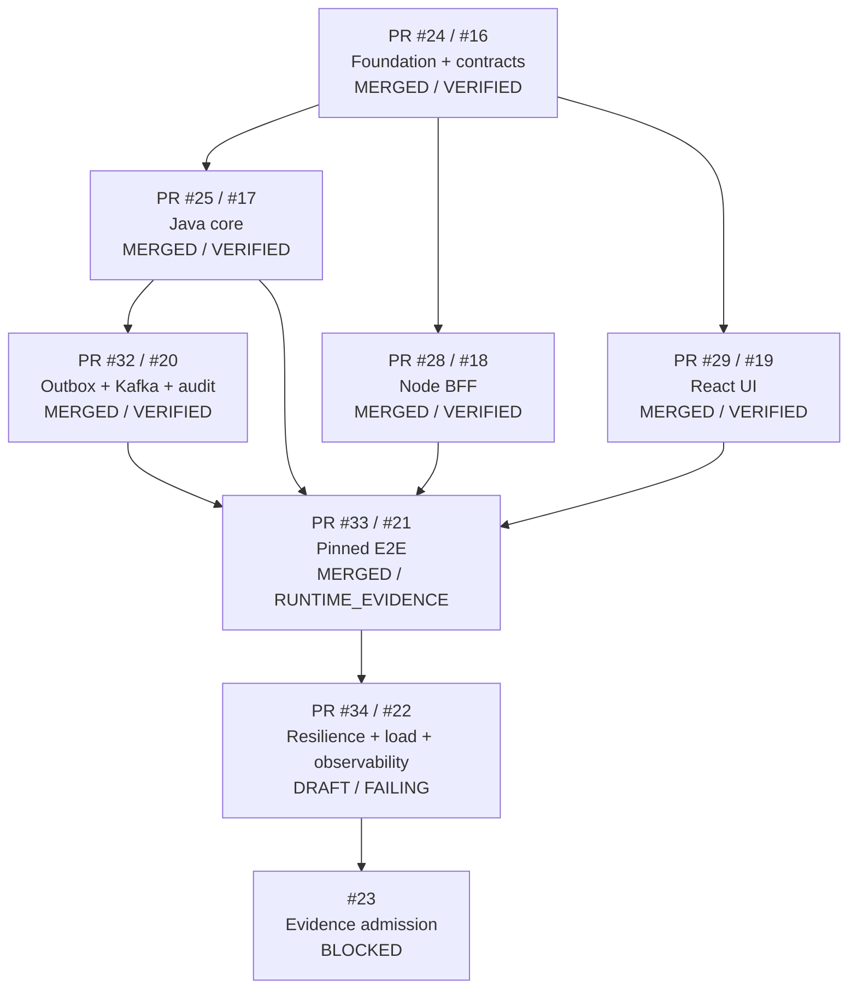

# Stacked PR Delivery Index

This directory is the canonical implementation-routing index for the molecular Stack PR plan. It records both **semantic parentage** and the immutable subject/merge receipts that let a reviewer trace merged behavior back to the exact node that proved it.

## Current stack state

## Implemented Stack PR receipts

| Node | Issue / PR | Branch | Exact subject head | State at admission | Main merge commit | Scope / evidence ceiling |
|---|---|---|---|---|---|---|
| PR-0 | #16 / #24 | `agent/full-stack-readiness-mvp-foundation` | `f0a7e00cfdb6e80ca6f9b128f280110ccf4a3fc9` | `VERIFIED` | `f91c2e48f98c8f13f854fe8e2444934cee44c862` | contracts, architecture, governance; not MVP/runtime |
| PR-1 | #17 / #25 | `agent/pr1-java-work-service` | `10d8ecb3366d9ccfd21bcde102dd13cd8fbdc159` | `VERIFIED` | `b3c30c416031b4ab820883ab2e3694572fec12f9` | Java transaction/idempotency/concurrency; no saturation/load claim |
| PR-2 | #18 / #28 | `agent/pr2-node-bff` | `1ee2ba05bbd1c5bde5f2c7b6f7e39a41024faf29` | `VERIFIED` | `a4f71b95c7e40ed0b04c6396e4acffe460ae9959` | deterministic single-process edge policy; no distributed fairness/runtime claim |
| PR-3 | #19 / #29 | `agent/pr3-react-work-queue` | `a41f310050934dc182cb4e136a326da48557f24e` | `VERIFIED` | `5acc847e705f55071fd969619af2c7acde92aff4` | React async-state correctness; no browser/load/production UX claim |
| PR-4 | #20 / #32 | `agent/pr4-outbox-kafka` | `fcb161363d7b87be5757fdee0fa00007277abacf` | `VERIFIED` | `60c81cc9c7ead888378b09bd7cb6af57d8a8e544` | transactional outbox, duplicate delivery, DLT/recovery component semantics; no exactly-once/SLO claim |
| PR-5 | #21 / #33 | `agent/pr5-e2e-runtime` | `c8e644fbd85cf495bc11b7954c38ef075d828702` | `RUNTIME_EVIDENCE` | `301c60982f1d2c9c26900dc946b628627ba6362a` | one pinned deterministic React->BFF->Java->DB->outbox->Kafka->audit happy path |
| PR-6 | #22 / #34 | `agent/pr6-resilience-observability` | `62f510759b1a9418c325cad8337a31b8c5f6bd18` | `IMPLEMENTED / FALSIFICATION_IN_PROGRESS` | **not merged** | resilience/load/telemetry admission is blocked by failing exact-head workflow |

## Active PR-6 falsification receipt

Latest exact-head workflow for PR-6:

- run `32389681008`
- job `96492505763`
- artifact ID `9414468450`
- artifact name `pr6-resilience-62f510759b1a9418c325cad8337a31b8c5f6bd18`
- digest `sha256:8ec6bb6968c62a3d77bae8723e037a6edf1f2c437b77bc61b7360b1689f48b67`

The run fails before resilience admission because `work-service-1` cannot complete Flyway bootstrap with the fault-sized Hikari pool. A separate cleanup helper can also mask failures under `set -u`. See `docs/handoff/LOCAL_HANDOFF_EXECUTION_QUEUE.md` and issue #22.

## Node ownership and exit gates

| Node | Primary paths | Semantic dependencies | Exit gate |
|---|---|---|---|
| PR-0 | `README.md`, `AGENTS.md`, `docs/**`, `packages/contracts/**`, foundation CI | none | contracts parse + governance/architecture checks |
| PR-1 | `services/work-service/**` | PR-0 | Java persistence/domain/idempotency/concurrency checks |
| PR-2 | `apps/bff/**` | PR-0 | typed client, boundary, validation, timeout/retry/rate-limit/shutdown checks |
| PR-3 | `apps/web/**` | PR-0 | list/create/transition state/error/stale-response correctness checks |
| PR-4 | `services/work-service/**`, `services/audit-consumer/**`, compatible event infra/contracts | PR-1 | transactional outbox + duplicate/DLT/recovery component checks |
| PR-5 | `infra/integration/**`, `tests/contract/**`, `tests/e2e/**` | PR-1..4 | pinned full user journey executable against real PostgreSQL + Kafka |
| PR-6 | `infra/resilience/**`, `tests/failure/**`, `tests/load/**`, telemetry/runbooks | PR-5 | minimum #22 failure set executed with correlated telemetry + load/recovery receipts |
| PR-7 | `docs/evidence/**`, admission/interview material | PR-6 | exact evidence chain + Shadow audit + human admission decision |

## Parallelism and parentage rules

- PR-1, PR-2, and PR-3 were sibling nodes from the frozen PR-0 boundary; they did not depend on each other's implementation bytes.
- PR-4 depends on Java transaction semantics.
- PR-5 integrates PR-1..4; it does not redesign ownership boundaries.
- PR-6 must execute real faults against the integrated topology; inherited component tests are useful regression evidence but cannot substitute for its runtime receipts.
- PR-7 can package only evidence that already exists. It cannot promote unsupported claims.
- When a parent is merged and a child is retargeted to `main`, verify that the child's subject bytes still represent the same semantic node and re-check mergeability. Do not treat retargeting itself as new evidence.

## git-town-stacked-pr-worker invariants

1. One semantic concern per stack node.
2. Parentage follows dependency, not convenience.
3. Sibling nodes use disjoint ownership where possible.
4. Contracts cannot be silently changed by a consumer branch to make local code pass.
5. Exact subject head is recorded before admission.
6. Main merge receipt is recorded separately from the verified subject head.
7. Merge commits do not inflate evidence state.
8. Unfinished nodes stay open and enter the Local Handoff Execution Queue.
9. No automatic semantic conflict resolution for API/event schemas, migrations, domain state machines, or evidence records.

## Side-control lanes

- #27 is the intentional holding lane for deferred controls. Promotion requires requirement IDs, outcome, paths, failure semantics, acceptance evidence, evidence ceiling, and DAG position.
- #30 is the release-shape license review for Vite/lightningcss MPL-2.0 obligations. It is not a functional PR-3 blocker but remains open before distributable release/toolchain closure.