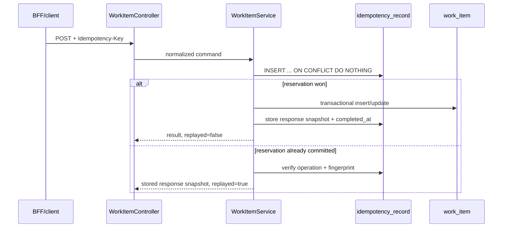

# Java Work Service

Stack node: **PR-1 / issue #17**. This service owns the Operations Work Queue transactional domain boundary defined by ADR-0001.

## Responsibilities

- work-item state-machine invariants;
- PostgreSQL schema, constraints, indexes, and migrations;
- idempotent mutation semantics;
- optimistic concurrency with version checks;
- typed HTTP conflict/error responses;
- request correlation at the Java boundary.

It does **not** own frontend state, BFF retry/rate-limit policy, Kafka publication, or the eventual audit projection.

## Data path



The idempotency reservation, domain mutation, and response snapshot are in the same Spring transaction. A failed command rolls the reservation back, so a later safe retry can execute rather than becoming stuck behind an incomplete record.

## Concurrency invariant

State transitions use:

```sql
UPDATE work_item
SET status = :next,
    version = version + 1,
    updated_at = now()
WHERE id = :id AND version = :expectedVersion
RETURNING ...;
```

Exactly one competing update can consume a given version. A zero-row result becomes `VERSION_CONFLICT`; there is no last-write-wins overwrite.

## Current proof

`WorkItemServiceIntegrationTest` uses a real PostgreSQL instance in CI and covers:

- same idempotency key + same request -> one resource + replayed response;
- same idempotency key + different request -> `IDEMPOTENCY_CONFLICT`;
- concurrent duplicate create -> one work-item row;
- concurrent transitions from the same version -> one winner + one `VERSION_CONFLICT`;
- invalid transition -> transaction rollback and unchanged state.

`scripts/smoke_work_service.py` starts from the HTTP boundary and verifies create/replay/conflict/transition behavior plus `X-Request-Id` correlation.

These tests are portfolio verification, not evidence of prior production traffic or incident ownership.

## Local run

Prerequisites: Java 21, Maven, PostgreSQL 18-compatible server.

```bash
export DATABASE_URL=jdbc:postgresql://127.0.0.1:5432/workqueue
export DATABASE_USER=workqueue
export DATABASE_PASSWORD=workqueue
mvn -f services/work-service/pom.xml spring-boot:run
```

Run tests against an available PostgreSQL database:

```bash
mvn -f services/work-service/pom.xml verify
```

The GitHub Actions job provisions PostgreSQL and runs both Maven verification and the HTTP smoke automatically.

## Deferred to later stack nodes

- transactional outbox and Kafka relay: issue #20;
- multi-service E2E topology: issue #21;
- DB pool exhaustion/load/failure evidence: issue #22;
- human admission/interview packaging: issue #23.
